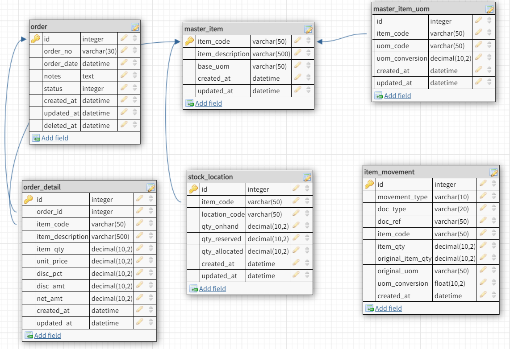

# Background 

Situasi yang terjadi dikarenakan ada hot sale di event tertentu menyebabkan ada lonjakan transaksi. 

Efek lanjut dari lonjakan transaksi tersebut menyebabkan banyak terjadinya request stock bersamaan, sehinggal seolah-olah tidak ada stock yang available atau stocknya minus.

Akibat dari kejadian ini karena stock minus, akibatnya transaksi tidak bisa dilanjutkan, akibat banyak transaksi yang tidak bisa lanjut karena stock di system tidak ada berimplikasi banyak hal

 - sentimen konsumen menjadi negatif
 - konsumen tidak kembali lagi
 - stok sebenarya masih ada

## Situasi yang terjadi

Situasi ini terjadi karena ada lonjakan transaksi yang mendadak dalam suatu waktu tertentu.
Ketidaksiapan system dalam menghadapi situasi ini menyebabkan seolah-olah stock kosong atau bahkan minus yang ada kemungkinan disebabkan oleh reservasi stock yang datang bersamaan dan kurang ditangani dengan baik oleh system.

## Pendekatan Solusi 

Harus dibuatkan mekanisya agar available stock real sama dengan stock di system.
Ada beberapa pendekatan yang bisa dilakukan

 - Dibuatkan funsi api yang bisa menampilkan stock yang available
 - Jika ada transaksi pilih barang (add to cart), akan mengurangi stock available, tetapi harus ada pembatasan waktu. Artinya jika tidak segera di proses akan batal checkout dan stock di kembalikan lagi
 - Peningkatan bandwith ataupun dengan menggunakan load balancer sehingga peningkatan traffic tidak menyebabkan server down.
 - Menggunakan layanan yang bisa mengotomatis bisa menghandle traffic.

## Desain Database

Berikut desain sederhana database terkait:
[](https://www.google.com/)


## Api yang digunakan

 - GET {base-url}/catalogs?page=1&limit=10&sortBy=sales&sortDir=desc
 - GET {base-url}/catalogs?category=electronic
 - GET {base-url}/catalogs?search=mouse
 - POST {base-url}/chart
 - PUT {base-url}/chart/:sku/:qty
 - GET {base-url}/chart
 - POST {base-url}/checkout
 - POST {base-url}/payment

untuk di local, {base-url} bisa diganti http://localhost:9000 

## Menjalankan aplikasi

untuk menjalankan aplikasi, ketik

``` npm start ```
